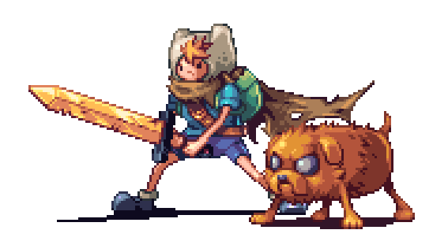

<h1 align="center">print("Hey  , I'm Victor ODGodinho 👨‍💻 💻")</h1>

 
 

Hi, I'm Victor Alves, a Full Stack Developer, currently i'm a Software Development Manager at [@BlwConstrutora | @CasaPlenoImoveis](https://www.casaplenoimoveis.com.br/). I'm solve problems with quality and performance, I’m constantly interested in evolving with technology.

### - 👀 About me 

- 🖥 Full stack development;
- 🎓 Graduated in ( Information System | Internet System );
- 📙 seedling I’m currently learning React Native;
- 💬 Ask me about anything, I am happy to help;
- ⏲ Anything is possible, it's all about time and money;
- ⚡️ I'm have ease in developing complex high performance SQL 
- 📝 [Resume](https://www.linkedin.com/in/victor-alves-odgodinho/)

### - ⌨ Technologies / Skills / Tools

- #### Front End
    - 
    - 
    - 
    - 
    - 
    - 
    - 
    - 
    - 

- #### SQL / NoSql / Data
    - 
    - 
    - 
    - 
    - 

- #### Back End
    - 
    - 
    - 
    - 
    - 
    - 
    - 
    - 
    - 

- #### Development / Softwares
    - 
    - 
    - 
    - 
    - 
    - 
    - 
    - 
    - 
    - 
    - 
    - 
    - 
    - 
    - 
    - 

- #### Design
    - 

 

### - 🍻 Connect with ME

 

